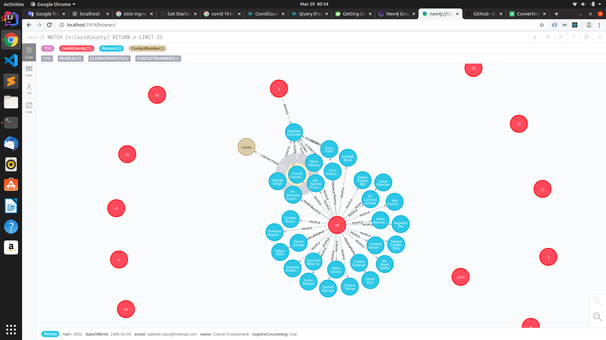

### COVID-19 Map Visualization

The idea of this project is to help somehow and show a map with people infected per area and warn close contacts to avoid spread the virus.

### Requirements
* NEOJ4(NoSql)
* Java
* Maven

# Getting Started

Run NEO4J

`
docker run -it     --publish=7474:7474 --publish=7687:7687 --env=NEO4J_AUTH=none     --volume=$HOME/neo4j/data:/data     neo4j
`

Run Spring Boot

`
mvn spring-boot:run
`

Clean NEO4J data

`
sudo rm -rf ~/.neo4j/data/
`

Screenshot

### Reference Documentation
For further reference, please consider the following sections:

* [Official Apache Maven documentation](https://maven.apache.org/guides/index.html)
* [Spring Boot Maven Plugin Reference Guide](https://docs.spring.io/spring-boot/docs/2.2.6.RELEASE/maven-plugin/)
* [Spring Data Neo4j](https://docs.spring.io/spring-boot/docs/2.2.6.RELEASE/reference/htmlsingle/#boot-features-neo4j)

### Guides
The following guides illustrate how to use some features concretely:

* [Accessing Data with Neo4j](https://spring.io/guides/gs/accessing-data-neo4j/)

